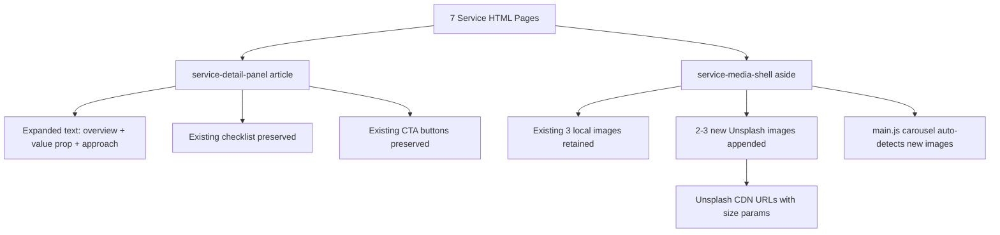

# Design Document: Service Content Expansion

## Overview

This feature expands the 7 MATHISS Consulting service detail pages by enriching both visual and textual content. Each page currently has a 3-image carousel and a brief summary with a 6-item checklist. The expansion adds 2–3 Unsplash images per carousel (reaching 5–6 total) and introduces structured written content (overview, value proposition, approach) above the existing checklist.

The site is a static HTML website with a shared `css/styles.css` stylesheet and a `js/main.js` file that drives carousel behaviour via `data-carousel` attributes. The carousel JS dynamically reads all `.media-tile` images inside each `[data-carousel]` container and cycles through them — no code changes are needed to support additional images.

All 7 service pages share an identical HTML structure:
- `page-hero` section with background image
- `service-showcase` container with `service-detail-panel` (article) and `service-media-shell` (aside)
- The detail panel contains: `h2`, summary `p`, `h3` "What's Included:", `ul.service-checklist`, and CTA buttons
- The media shell contains arrow buttons and a `service-media-grid` div with `data-carousel` attribute and 3 `img.media-tile` elements

## Architecture

This is a content-only change across 7 static HTML files. No new components, scripts, or stylesheets are introduced.

### Design Decisions

1. **Append Unsplash images after existing local images** — The existing images are kept as the first items in the carousel. New Unsplash images are appended after them. This preserves the current first-visible image and avoids breaking any cached references.

2. **No JS or CSS changes required** — The `main.js` carousel reads `tiles.length` dynamically from the DOM. Adding more `.media-tile` `` elements inside the `[data-carousel]` container is all that's needed. The carousel's circular navigation, auto-scroll, and opacity transitions work with any image count.

3. **Unsplash CDN URL format with size parameters** — All new images use `https://images.unsplash.com/photo-{id}?w=800&q=80` format to control download size and quality, keeping page load reasonable.

4. **New text sections use existing CSS classes and semantic HTML** — New content sections (overview, value proposition, approach) are added as `
` elements and `<h3>` headings within the existing `service-detail-panel` article, using the same class patterns already in `styles.css`. No new CSS classes are needed.

5. **Consistent content order across all 7 pages** — Every service page follows the same structure: `h2` title → overview paragraph → `h3` "Why This Matters" → value proposition paragraph → `h3` "Our Approach" → approach paragraph → `h3` "What's Included:" → checklist → CTA buttons.

## Components and Interfaces

### Modified Components (per service page)

**service-detail-panel (article)**
- Current: `h2` + summary `p` + `h3` + `ul` + CTA buttons
- Expanded: `h2` + overview `p.service-summary` + `h3` "Why This Matters" + value `p` + `h3` "Our Approach" + approach `p` + `h3` "What's Included:" + `ul.service-checklist` + CTA buttons

**service-media-grid (div[data-carousel])**
- Current: 3 `img.media-tile` elements
- Expanded: 5–6 `img.media-tile` elements (existing 3 + 2–3 new Unsplash images)

### Unchanged Components
- `page-hero` section — no changes
- `site-header` / `site-footer` — no changes
- `main.js` carousel logic — no changes (auto-detects image count)
- `css/styles.css` — no changes

### Image Specification Per Service

| Service Page | Existing Images | New Unsplash Images | Total |
|---|---|---|---|
| Township Planning | 3 local | 3 Unsplash (urban planning, aerial city, township development) | 6 |
| Architecture | 3 local | 3 Unsplash (building facades, interior design, modern architecture) | 6 |
| Engineering | 3 local | 2 Unsplash (bridge/infrastructure, structural steel) | 5 |
| Construction | 3 local | 3 Unsplash (active site, scaffolding, building progress) | 6 |
| Quantity Surveying | 3 local | 2 Unsplash (cost estimation, blueprints with measurements) | 5 |
| Land Surveying | 3 local | 3 Unsplash (surveying equipment, topographic work, aerial terrain) | 6 |
| Related Services | 3 local | 2 Unsplash (consulting meeting, project governance) | 5 |

## Data Models

No data models are involved. This feature modifies static HTML content only. The "data" is:
- Unsplash image URLs (hardcoded in HTML `src` attributes)
- Descriptive `alt` text strings (hardcoded in HTML `alt` attributes)
- Paragraph text content (hardcoded in HTML)

## Error Handling

- **Unsplash image load failure**: The carousel JS shows/hides images via `display:block/none`. If an Unsplash image fails to load (CDN down, URL changed), the browser renders a broken image icon for that slide, but the carousel continues cycling through remaining images. The `navigateCarousel` function uses modular index arithmetic based on `totalTiles`, so it won't break — it will just show a broken tile for that index.
- **Mitigation**: Use well-established Unsplash photo IDs that are unlikely to be removed. The `loading="lazy"` attribute on non-first images prevents blocking page render if an image is slow or fails.
- **Content fallback**: If expanded text content needs to be reverted, the original summary paragraph and checklist remain in place — the new sections are additive and can be removed without affecting the rest of the page.

## Testing Strategy

### Why Property-Based Testing Does Not Apply

This feature involves only static HTML content changes — adding images and text to existing pages. There are no functions, data transformations, parsers, serializers, or business logic being written or modified. The carousel JS (`main.js`) is not being changed. PBT requires code with input/output behaviour to test, which does not exist here.

### Manual Testing Approach

1. **Visual inspection per page** — Load each of the 7 service pages and verify:
   - Carousel displays 5–6 images and cycles correctly with arrows and auto-scroll
   - Existing local images appear first in the sequence
   - New Unsplash images load correctly and are visually relevant to the service
   - All images have descriptive `alt` text (inspect via DevTools)
   - Non-first images have `loading="lazy"` attribute

2. **Content structure verification** — For each page, confirm:
   - Overview paragraph is present (minimum 3 sentences)
   - "Why This Matters" section is present (minimum 2 sentences)
   - "Our Approach" section is present (minimum 2 sentences)
   - Existing "What's Included" checklist is preserved with all 6 items
   - CTA buttons remain functional
   - Section order is consistent across all 7 pages

3. **Responsive layout check** — Test each page at mobile (375px), tablet (768px), and desktop (1200px+) widths to confirm no layout breaks from the additional content.

4. **Accessibility check** — Verify:
   - All new `` elements have non-empty `alt` attributes
   - New headings (`h3`) maintain logical hierarchy (h2 → h3)
   - Carousel arrow `aria-label` attributes are unchanged

5. **Cross-browser smoke test** — Load at least one service page in Chrome, Firefox, and Safari to confirm images load and carousel functions.

### Automated Validation (Optional)

A simple HTML linting pass (e.g., `htmlhint` or `html-validate`) can verify:
- All `` tags have `alt` attributes
- Heading hierarchy is correct
- No duplicate IDs or broken HTML structure
