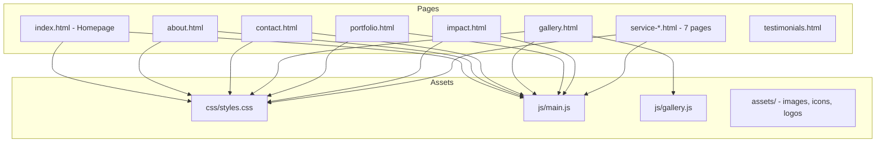

# Design Document: Website Redesign

## Overview

This design covers the redesign of the MATHISS Consulting static website to adopt clean, modern SaaS-style design patterns (inspired by methvin.org) while preserving the existing navy/red brand identity and all page content. The redesign focuses on three pillars:

1. **Visual polish** — scroll-triggered entrance animations, hover transitions, and smooth section transitions
2. **Layout modernization** — alternating image-text rows, persona cards, and a refreshed hero section following SaaS conventions
3. **Consistency and accessibility** — uniform page structure, responsive navigation, form validation, gallery filtering, and `prefers-reduced-motion` support

The project is a static HTML/CSS/JS site with no build tools or frameworks. All changes are made directly to HTML files, `css/styles.css`, `js/main.js`, and `js/gallery.js`.

### Key Design Decisions

- **No framework introduction**: The site remains vanilla HTML/CSS/JS. Adding a framework would be overkill for a static brochure site and would break the existing deployment model.
- **Intersection Observer for animations**: Native browser API, zero dependencies, good performance. Already partially used in gallery.js for staggered entry.
- **CSS custom properties for theming**: Already in place via `:root` variables. The redesign extends this system rather than replacing it.
- **Progressive enhancement**: Animations are additive. The site works fully without JS; animations enhance the experience for capable browsers.

## Architecture

The site follows a flat static architecture with no server-side rendering or build pipeline.



### Change Strategy

The redesign modifies existing files in-place rather than creating new ones:

| File | Changes |
|------|---------|
| `css/styles.css` | Add animation classes, refine hover transitions, add scroll-animation utility classes, ensure `prefers-reduced-motion` coverage |
| `js/main.js` | Add Intersection Observer-based scroll animation system, staggered delay logic |
| `js/gallery.js` | Minor refinements to filter transitions (already well-implemented) |
| `index.html` | Add animation data attributes/classes to sections, cards, feature rows |
| All HTML pages | Ensure consistent header/footer, page-hero structure, animation classes on key elements |

No new files are introduced. No build tools are added.

## Components and Interfaces

### 1. Animation System (`js/main.js`)

The core addition is a reusable scroll-triggered animation system using Intersection Observer.

```
┌─────────────────────────────────────────────┐
│  Animation System                           │
│                                             │
│  initScrollAnimations()                     │
│    ├─ Query all [data-animate] elements     │
│    ├─ Create IntersectionObserver           │
│    │   threshold: 0.1                       │
│    │   rootMargin: "0px 0px -50px 0px"      │
│    ├─ On intersect:                         │
│    │   ├─ Add .is-visible class             │
│    │   ├─ Apply stagger delay from          │
│    │   │  data-delay attribute              │
│    │   └─ Unobserve (fire once)             │
│    └─ Respect prefers-reduced-motion        │
│       └─ Skip observer, add .is-visible     │
│          to all elements immediately         │
└─────────────────────────────────────────────┘
```

**Interface (HTML data attributes)**:
- `data-animate` — marks an element for scroll-triggered animation
- `data-animate="fade-up"` — fade in + slide up (default)
- `data-animate="fade-left"` — fade in + slide from left
- `data-animate="fade-right"` — fade in + slide from right
- `data-delay="N"` — stagger delay index (multiplied by a base delay, e.g., 80ms)

**CSS classes**:
- `.scroll-animate` — initial hidden state (opacity: 0, transform offset)
- `.scroll-animate.is-visible` — final visible state (opacity: 1, transform: none)
- Variants: `.scroll-animate-left`, `.scroll-animate-right`

### 2. Hover Transition System (`css/styles.css`)

Existing `.card-hover` class already provides lift + shadow. The redesign:
- Standardizes timing to 300ms for cards, 200ms for buttons/links
- Ensures gallery overlay uses slide-up reveal
- Adds social button hover lift (already present)
- Ensures service card image scale on hover (already present at 1.03x)

No new JS needed — all hover effects are CSS-only.

### 3. Gallery Filter System (`js/gallery.js`)

Already well-implemented. Minor refinements:
- Ensure `is-visible` class is applied via `requestAnimationFrame` for staggered entry (already done)
- Transition class `is-transitioning` on grid during filter swap (already done)

### 4. Contact Form Validation (`js/main.js`)

Already fully implemented with:
- Field-level validation on blur/input
- Required field checks (firstName, lastName, email, service, message)
- JSON POST to `/api/contact`
- Success modal with backdrop
- Error display in form status area
- Focus ring via CSS (brand red box-shadow)

No changes needed to form logic.

### 5. Service Detail Page Carousel (`js/main.js`)

Already implemented with:
- Carousel state management per `data-carousel` ID
- Left/right arrow navigation
- Auto-scroll every 5 seconds
- Pause on hover
- Fade transition between slides

No changes needed to carousel logic.

### 6. Responsive Navigation (`js/main.js`)

Already implemented:
- Hamburger toggle at ≤900px
- `aria-expanded` toggling
- Close on link click
- Services dropdown submenu
- Active page highlighting

No changes needed.

## Data Models

This is a static HTML/CSS/JS site with no database or API data models. The relevant data structures are:

### Gallery Image Object (in `js/gallery.js`)

```javascript
{
  id: Number,          // Unique identifier
  title: String,       // Display title
  category: String,    // Filter category: "construction" | "services" | "architecture"
  image: String,       // Relative path to image file
  description: String  // Overlay description text
}
```

### Contact Form Payload (in `js/main.js`)

```javascript
{
  firstName: String,   // Required, min 2 chars, alpha only
  lastName: String,    // Required, min 2 chars, alpha only
  email: String,       // Required, valid email format
  phone: String,       // Optional, 7-20 digit phone format
  company: String,     // Optional, min 2 chars if provided
  service: String,     // Required, from predefined list
  budget: String,      // Optional, from predefined ranges
  timeline: String,    // Optional, from predefined options
  message: String      // Required, min 20 chars
}
```

### Carousel State (in `js/main.js`)

```javascript
{
  currentIndex: Number,        // Current visible slide index
  totalTiles: Number,          // Total number of slides
  tilesPerView: Number,        // Slides visible at once (1)
  shell: HTMLElement,          // Container element
  grid: HTMLElement,           // Grid element
  tiles: NodeList,             // All slide elements
  autoScrollInterval: Number   // setInterval ID
}
```

### CSS Custom Properties (Brand Theme)

```css
--brand-navy-deep: #072456
--brand-navy-mid: #133b73
--brand-navy-bright: #224c86
--brand-red: #c81d38
--brand-red-light: #e1455c
--brand-navy-cta-start: #20477c
--brand-navy-cta-end: #12376d
--brand-navy-footer-start: #1a3b6a
--brand-navy-footer-end: #0f2e5d
```


## Correctness Properties

*A property is a characteristic or behavior that should hold true across all valid executions of a system — essentially, a formal statement about what the system should do. Properties serve as the bridge between human-readable specifications and machine-verifiable correctness guarantees.*

### Property 1: Alternating layout sections alternate image position

*For any* alternating image-text section (Delivery Flow or Featured Services), consecutive items must alternate their image position class (left/right). Specifically, for all indices `i` where `i > 0`, item `i` and item `i-1` must have different image-position classes.

**Validates: Requirements 2.2, 2.4**

### Property 2: Staggered animation delays are monotonically increasing

*For any* group of sibling elements with `data-delay` attributes, the computed `transition-delay` values must be monotonically increasing (i.e., each element's delay is greater than or equal to the previous sibling's delay).

**Validates: Requirements 4.3**

### Property 3: Scroll animations fire only once per element

*For any* element with the `data-animate` attribute, once the `is-visible` class has been added, the Intersection Observer must unobserve that element. Subsequent intersection events must not re-trigger the animation or modify the element's visibility state.

**Validates: Requirements 4.4**

### Property 4: Reduced motion disables all animations

*For any* element with scroll-animation or transition classes, when `prefers-reduced-motion: reduce` is active, the element must have `is-visible` applied immediately (no transition delay), and all CSS `animation` and `transition` properties must be set to `none`.

**Validates: Requirements 4.6, 13.6**

### Property 5: Consecutive sections alternate background treatment

*For any* pair of consecutive `<section>` elements within `<main>` on the homepage, if one has the `section-alt` class, the next must not, and vice versa — ensuring visual separation through alternating backgrounds.

**Validates: Requirements 6.1**

### Property 6: Content sections have minimum vertical padding

*For any* element with the `.section` class, the computed `padding-top` and `padding-bottom` must each be at least 3rem (48px at default font size).

**Validates: Requirements 6.2**

### Property 7: Consistent header and footer with logo across all pages

*For any* page in the site, the `<header>` must contain the MATHISS logo image and the same set of navigation links, and the `<footer>` must contain the MATHISS logo image and the same structural sections (brand, services, company, contact).

**Validates: Requirements 7.4, 11.1, 11.2**

### Property 8: Subpages have page hero with required elements

*For any* subpage (about, contact, gallery, portfolio, impact), the page must contain a `.page-hero` section with a `.hero-chip` element, an `<h1>` heading, and a `.lead` paragraph.

**Validates: Requirements 11.3**

### Property 9: Active navigation link matches current page

*For any* page, exactly one navigation link in the header must have the `.active` class, and its `href` attribute must match the current page filename.

**Validates: Requirements 11.4**

### Property 10: Contact form validation rejects empty required fields

*For any* required form field (firstName, lastName, email, service, message) that is left empty or contains only whitespace, the form must not submit, and the corresponding error element must display a non-empty error message.

**Validates: Requirements 9.1, 9.2**

### Property 11: Gallery filter shows only matching items

*For any* selected filter category, all visible gallery items must have a `category` property matching the selected filter. When "all" is selected, all gallery items must be visible.

**Validates: Requirements 10.2**

### Property 12: Service detail pages contain required structural elements

*For any* service detail page, the page must contain a service icon element, a service title heading, a summary description, a checklist of deliverables, and an image carousel with at least one media tile.

**Validates: Requirements 12.2, 12.3**

### Property 13: Below-fold images use lazy loading

*For any* `` element that is not within the initial viewport area (i.e., not in the header or hero section), the element must have the `loading="lazy"` attribute.

**Validates: Requirements 13.1**

### Property 14: All images have appropriate alt attributes

*For any* `` element on any page, the element must have an `alt` attribute. Content images (those not marked with `aria-hidden="true"`) must have a non-empty `alt` value. Decorative images (inside elements with `aria-hidden="true"`) must have an empty `alt` attribute.

**Validates: Requirements 13.2**

### Property 15: Semantic HTML structure on all pages

*For any* page, the document must contain exactly one `<header>`, one `<main>`, one `<footer>`, and at least one `<nav>` element with an `aria-label` attribute. All navigation landmarks and social media links must have `aria-label` attributes.

**Validates: Requirements 13.3, 13.5**

### Property 16: All interactive elements are keyboard accessible

*For any* interactive element (buttons, links, form inputs) on any page, the element must not have a negative `tabindex` value, ensuring it remains reachable via keyboard navigation.

**Validates: Requirements 13.4**

## Error Handling

### Contact Form Errors

| Scenario | Handling |
|----------|----------|
| Required field empty | Field-level error message displayed adjacent to field, field gets `.is-invalid` class and `aria-invalid="true"` |
| Invalid email format | "Enter a valid email address" shown in field error element |
| Invalid phone format | "Enter a valid phone number" shown (phone is optional) |
| Message too short | "Please provide at least 20 characters" shown |
| Multiple invalid fields | All invalid fields highlighted, form status shows "Please correct the highlighted fields" |
| Network/server error on submit | Error message from server displayed in `.form-status` area, form fields preserved |
| Successful submission | Form reset, all field states cleared, success modal displayed |

### Gallery Errors

| Scenario | Handling |
|----------|----------|
| No images match filter | Empty grid displayed (no error state needed — the data is static and all categories have items) |
| Image fails to load | Browser default broken image behavior; `alt` text provides context |

### Animation Errors

| Scenario | Handling |
|----------|----------|
| Intersection Observer not supported | Elements remain in their initial CSS state (visible by default if CSS is written progressively) |
| `prefers-reduced-motion` active | All animations skipped, elements shown in final state immediately |

### Navigation Errors

| Scenario | Handling |
|----------|----------|
| JavaScript fails to load | Navigation links are standard `<a>` elements and work without JS. Mobile menu toggle won't function, but links are still accessible in the DOM |
| Dropdown hover on touch devices | CSS `:focus-within` provides fallback for touch interaction on the services dropdown |

## Testing Strategy

### Dual Testing Approach

The testing strategy uses both unit/example tests and property-based tests for comprehensive coverage.

**Property-Based Testing Library**: [fast-check](https://github.com/dubzzz/fast-check) — the standard PBT library for JavaScript. It integrates with any test runner and provides shrinking, replay, and configurable iteration counts.

**Test Runner**: Any standard JS test runner (e.g., Vitest or Jest) with jsdom for DOM testing.

### Unit / Example Tests

Unit tests cover specific examples, edge cases, and integration points:

- Hero section contains required elements (h1, CTA buttons, chip, badge list) — Req 1
- Persona cards each have title and description — Req 3.2
- Intersection Observer is created on init — Req 4.1
- Adding `is-visible` class triggers CSS transition — Req 4.2
- Animation classes applied to correct element types — Req 4.5
- CTA band has correct gradient background — Req 6.3
- Footer has correct gradient background — Req 6.4
- CSS custom properties defined with correct values — Req 7.1
- Font families correct for headings and body — Req 7.2
- Mobile menu toggle opens/closes nav — Req 8.2, 8.3
- Header is sticky — Req 8.4
- Services dropdown has 7 links — Req 8.5
- Valid form submission sends POST to /api/contact — Req 9.3
- Successful response resets form and shows modal — Req 9.4
- Error response preserves form and shows error — Req 9.5
- Gallery filter bar has all category buttons — Req 10.1
- Gallery items animate on viewport entry — Req 10.4
- All 7 service detail pages exist — Req 12.1
- Carousel arrow click advances slide — Req 12.4

### Property-Based Tests

Each property test runs a minimum of 100 iterations and references its design property.

| Property | Test Description | Tag |
|----------|-----------------|-----|
| 1 | Generate random alternating section with N items, verify consecutive items alternate position | Feature: website-redesign, Property 1: Alternating layout sections alternate image position |
| 2 | Generate random groups of elements with data-delay, verify delays are monotonically increasing | Feature: website-redesign, Property 2: Staggered animation delays are monotonically increasing |
| 3 | Simulate multiple intersection events on an animated element, verify is-visible added once and observer disconnects | Feature: website-redesign, Property 3: Scroll animations fire only once per element |
| 4 | Generate random set of animated elements, enable reduced-motion, verify all have is-visible and no transitions | Feature: website-redesign, Property 4: Reduced motion disables all animations |
| 5 | Parse homepage HTML, verify consecutive sections alternate section-alt class | Feature: website-redesign, Property 5: Consecutive sections alternate background treatment |
| 6 | Parse all pages, verify .section elements have padding ≥ 3rem | Feature: website-redesign, Property 6: Content sections have minimum vertical padding |
| 7 | Parse all page HTML files, verify header/footer contain logo and consistent nav links | Feature: website-redesign, Property 7: Consistent header and footer with logo across all pages |
| 8 | Parse all subpage HTML files, verify page-hero contains chip, h1, lead | Feature: website-redesign, Property 8: Subpages have page hero with required elements |
| 9 | For each page, simulate active link detection, verify exactly one link is active and matches page | Feature: website-redesign, Property 9: Active navigation link matches current page |
| 10 | Generate random combinations of empty/filled required fields, verify form rejects when any required field is empty | Feature: website-redesign, Property 10: Contact form validation rejects empty required fields |
| 11 | Generate random filter selections from available categories, verify all visible items match filter | Feature: website-redesign, Property 11: Gallery filter shows only matching items |
| 12 | Parse all service detail pages, verify each contains icon, title, summary, checklist, carousel | Feature: website-redesign, Property 12: Service detail pages contain required structural elements |
| 13 | Parse all pages, verify below-fold images have loading="lazy" | Feature: website-redesign, Property 13: Below-fold images use lazy loading |
| 14 | Parse all pages, verify all img elements have alt attributes with correct empty/non-empty values | Feature: website-redesign, Property 14: All images have appropriate alt attributes |
| 15 | Parse all pages, verify semantic structure (header, main, footer, nav with aria-label) | Feature: website-redesign, Property 15: Semantic HTML structure on all pages |
| 16 | Parse all pages, verify no interactive element has negative tabindex | Feature: website-redesign, Property 16: All interactive elements are keyboard accessible |
